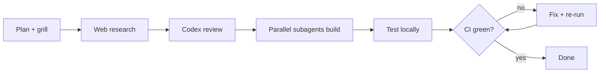

# AI-Assisted Development: Shipping a Diagram Renderer with Agents

I wanted this blog to render diagrams: mermaid, plantuml, and inline svg, all without shipping a single diagram library to the reader's browser. This is a short case study of how that feature got built with AI-assisted development, where the agents changed the outcome, and where they quietly failed until I checked.

The goal was concrete. A reader loads a post, sees a rendered diagram, and the page ships no runtime rendering code. Every diagram converts to static svg at build time.

## The task

The blog is a small Vite and React app. Posts are markdown files, inlined into the JavaScript bundle at build time through Vite's `import.meta.glob`. I wanted authors to write diagrams as fenced code blocks, like this:

````markdown

````

When the app builds, those blocks should become inline svg. The browser never loads mermaid or plantuml. The feature had four parts: a Vite plugin to do the conversion, a sanitize schema so the inline svg is safe, the converters themselves (mermaid via headless chromium, plantuml via java), and CI to run it all on every push.

## The agentic loop

I did not write this feature alone in a text editor. It came out of an agentic loop that looked roughly like this:



Each box was a different tool doing what it is good at. Planning started in plan mode, where I was grilled one question at a time until every design decision was pinned down: build-time versus runtime, plugin versus remark transformer, how svg reaches the renderer. The grill forced commitments before any code existed.

Web research came next. Three parallel searches confirmed the right package for each diagram type and surfaced the drawio conversion options. That is where I learned that plantuml ships a jar, that mermaid's official path is a chromium-based cli, and that a niche package called drawio2svg claimed to convert draw.io xml in pure node.

Then Codex reviewed the plan. This is the step I underestimated.

## Where the tools changed the outcome

Codex caught three things I would have shipped wrong.

First, the sanitize schema. I had written svg attribute names in their html spellings: `stroke-width`, `xlink:href`. Codex pointed out that `rehype-sanitize` matches hast property names, which are camelCase: `strokeWidth`, `xLinkHref`. The html spellings get silently dropped, and mermaid links would have broken. Fixed before any code ran.

Second, the plantuml invocation. My plan used shell-style stdin redirection, `java -jar plantuml.jar -tsvg -pipe < tmp`. Codex noted that node's `spawn` does not interpret shell redirection. You have to pipe stdin programmatically. Another bug that would have surfaced only at runtime.

Third, Codex flagged that the drawio converter was a mini markdown pipeline and warned me to track referenced files as dependencies and include converter versions in the cache key. Good advice I followed.

The parallel subagents then did the wiring. Four single-file edits, each handed to its own builder agent running at the same time: the glob query change, the renderer's rehype plugins, the Vite config registration, and the CI java step. No conflicts, because each touched a different file. That is the sweet spot for parallel agents: independent, well-scoped edits with no shared files.

Then CI caught what nobody caught.

## What CI caught

The local build passed. The diagrams rendered. I pushed the branch and triggered a workflow run, and the build came back green. But the log told a different story. Mermaid had failed:

```
mmdc exit 1: Failed to launch the browser process
No usable sandbox! ... unprivileged user namespaces with AppArmor
```

Chromium on the Ubuntu runner needs `--no-sandbox`. Locally it never came up. Worse, my plugin caught the error and continued, so the build exited zero while the mermaid diagram silently stayed as raw markdown. A green check on a broken feature.

Two fixes. I added a puppeteer config with `--no-sandbox`, `--disable-setuid-sandbox`, and `--disable-dev-shm-usage`, passed to the mermaid cli. And I made the plugin fail loud: a diagram that cannot convert now fails the build instead of being swallowed. The next CI run built clean in nine seconds with no errors.

The lesson is blunt. Silent success is the most dangerous failure mode in AI-assisted development. An agent will often wrap risky operations in a try/catch so the overall task completes. A passing build is not a working feature. Verify the actual output, not the exit code.

## Lessons

A few things held up across the whole feature.

Scope your reviewer to the directory it needs. My first Codex review ran against the whole monorepo, which has many large submodules. It stalled for ten minutes with zero output and I killed it. Running Codex from inside the blog directory, with an instruction not to scan the parent repo, finished in seconds. Big trees make agents wander.

Use parallel subagents for independent edits, not for coupled features. The wiring edits were perfect for parallel agents: one file each, no overlap. The core plugin was not. It was a new, tightly coupled feature, and that is main-thread work. Forcing it onto parallel builders would have produced integration bugs.

Fan out research, converge on a plan, then build sequentially. The pattern that worked was broad parallel exploration up front, a single reviewed plan in the middle, and careful sequential implementation with verification at the end.

## What I would do differently

I trusted the drawio package too long. The web search listed it as a pure typescript library with zero browser dependencies. In practice it shipped uncompiled `.ts`, and its dependency imported Android-native modules called `gui` and `coroutine` that no node bundler can resolve. I spent a real iteration discovering that. Next time I would do a thirty-second install-and-import smoke test on any niche converter before designing around it.

I also declared done too early, at the local build. The real finish line was a green CI run with no errors in the log. Local success is necessary but not sufficient.

## FAQ

### Did the agents write all the code?
No. The agents drafted, reviewed, and wired. The judgment calls (build-time over runtime, fail loud over silent catch, dropping the broken drawio package) were mine. AI-assisted development still needs a driver.

### Is mermaid in the final bundle?
No. Mermaid, plantuml, and their tooling are dev dependencies. They run in CI and at build time. The shipped bundle contains only the converted svg strings.

### Was this faster than doing it solo?
Yes, clearly, but not because the agents were flawless. They were fast at breadth (parallel research, parallel edits) and good at catching specific mistakes (the hast property names). They were bad at knowing when something was actually finished. The speedup came from pairing their breadth with my verification.

---

*This post is part of the [Applicaudia blog](https://applicaudia.se/blog/). For more articles and insights from Applicaudia AB, visit [applicaudia.se](https://applicaudia.se). The diagram renderer described here runs this very page.*
