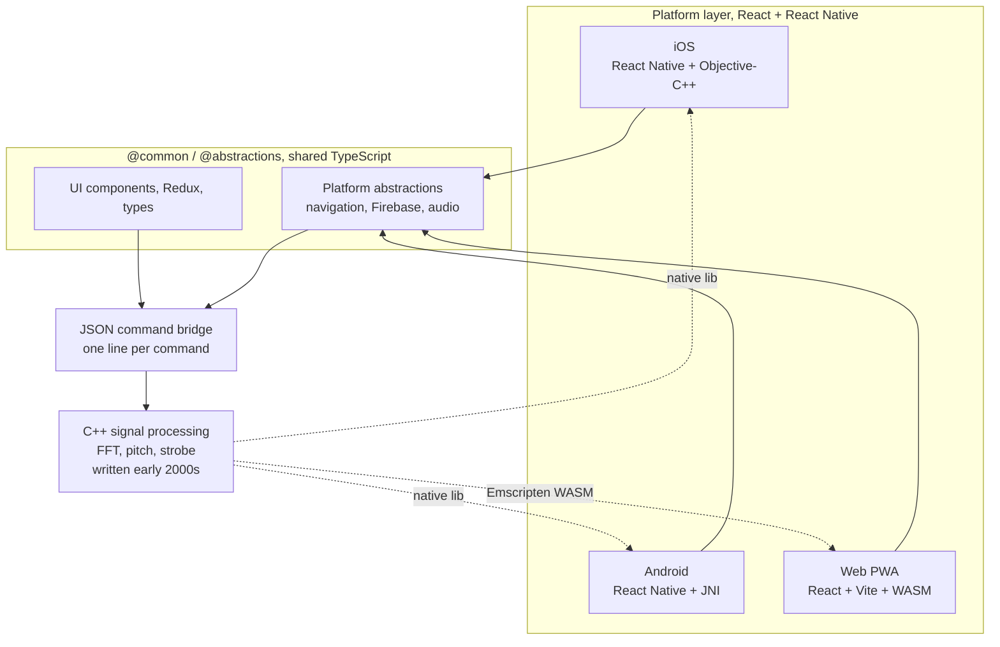

# Cross-Platform C++ React Native Integration for Solo Developers

Building native apps for iOS, Android, and web as a solo developer sounds impossible. Most teams struggle with this even with multiple engineers. Yet over the past five years, I have shipped multiple production apps that run on all three platforms while maintaining a single codebase that one person can handle.

The secret is not choosing between native performance and developer productivity. It is sharing code intelligently across platforms, putting performance-critical logic in C++, and using a JSON command bridge that makes adding new features take one line of code.

## The Architecture Pattern

The architecture has three layers. At the top, platform-specific JavaScript and TypeScript handle UI and platform integration. In the middle, a JSON command bridge forwards actions to native code. At the bottom, a C++ processing layer handles the heavy lifting.

This bottom layer compiles to native code for iOS and Android, and to WebAssembly for the web. The same algorithms written in the early 2000s run on all three platforms today without modification.



### Platform Layer: React + React Native Web

Each platform has its own entry point. iOS and Android use React Native. The web uses React with Vite. Despite the different frameworks, all three can share React components through the react-native-web package.

Some code is truly universal. Types, utility functions, Redux state management, and business logic live in `@common/` and get used by all platforms. Platform-specific code, such as navigation abstractions or Firebase initialization, lives in `@abstractions/` with separate implementations for web, iOS, and Android.

This separation means writing a game screen once in `@common/` and having it work on the PWA, mobile apps, and even Chromecast receiver without changes.

### JSON Command Bridge: One Line Adds Features

The bridge between JavaScript and C++ uses JSON commands. On the JavaScript side, you define a command structure with parameters. On the C++ side, a command handler processes it.

Adding a new command takes three steps. Define the structure. Implement the handler. Register it in the command table. That is it.

```cpp
static bool onCmdMyNewFeature(CmdHandlerNodeData* const pCmdData) {
  const json& jIn = pCmdData->jsonIn;
  CmdMyNewFeature s = jIn;  // Automatic deserialization
  json& jOut = pCmdData->jsonOut;
  
  CSLocker lock;  // Thread safety
  // Process command
  
  jOut["myNewFeatureCmd"] = "ok";
  return true;
}
```

This pattern runs identically on iOS, Android, and the web. The platform bridges forward the JSON string to C++, which parses it using the nlohmann/json library, executes the command, and returns the result.

### C++ Layer: Algorithms That Last Decades

The C++ layer contains signal processing algorithms written between 2001 and 2005. Fast Fourier transform analysis, pitch detection, harmonic verification, and IIR filtering all happen here.

This code compiles to native libraries for iOS and Android. For the web, Emscripten compiles it to WebAssembly. The same 5000 lines of C++ run on all three platforms.

Why does this matter? Algorithms written once continue working forever. I have not touched the core pitch detection code in years, yet it runs on modern iPhones, Android devices, and browsers without modification.

## How This Enables Single-Person Maintainability

### Write Once, Run Everywhere

When I add a feature to the JSON command layer, it automatically works on iOS, Android, and the web. I do not need to maintain three separate implementations. I do not need to worry about platform differences in audio or signal processing.

The platform bridges handle the platform-specific details. iOS uses Objective-C++ to call into C++. Android uses JNI. The web uses WebAssembly bindings. But those layers rarely change.

### Shared Components Reduce Mental Load

React components in `@common/` handle UI across platforms. Navigation abstractions in `@abstractions/` hide platform differences. I do not need to remember how navigation works on iOS versus Android versus the web. I call `navigate(nextScreen)` and the abstraction handles the rest.

This reduces cognitive load. Instead of context-switching between platform APIs, I focus on the business logic and features.

### Thread Safety Without Complexity

The C++ layer uses a task scheduler thread for command handlers and a separate audio thread for signal processing. A simple RAII-style lock, `CSLocker`, protects shared state.

The pattern is consistent across all command handlers. If a handler touches shared state, wrap it in `CSLocker`. The lock releases automatically when the handler returns. This works on native platforms and becomes a no-op on the single-threaded web, keeping the code clean.

## Real-World Examples

### StroboPro: Professional Audio Tuner

[StroboPro](https://strobopro.se) uses this architecture for its audio processing. The C++ layer handles pitch detection and strobe display. The JSON command bridge lets the JavaScript side control the tuner. The same code runs on the web, iOS, and Android.

Adding a new audio command takes one line in the C++ command table. The iOS, Android, and web apps all gain the feature simultaneously. Try it on the [App Store](https://apps.apple.com/us/app/precise-strobe-tuner-strobopro/id6455632707), [Google Play](https://play.google.com/store/search?q=strobopro&c=apps&hl=en-US), or [strobopro.se](https://strobopro.se).

### Zooked: Multi-Platform Gaming

[Zooked](https://apps.apple.com/app/id6757303318) takes the pattern further with four platforms. A PWA controller, mobile controller, Chromecast receiver, and Firebase Functions all share code through the same `@common/` and `@abstractions/` system.

Game screens written once run on all platforms. Platform-specific implementations hide navigation, Firebase, and routing differences. Available on the [App Store](https://apps.apple.com/app/id6757303318) and [Google Play](https://play.google.com/store/apps/details?id=se.applicaudia.zooked).

## The Trade-Offs

This approach requires upfront investment. Setting up the build system, C++ compilation, and platform bridges takes time. Emscripten adds complexity to the web build.

Debugging cross-platform issues can be challenging. A memory leak might only appear on one platform. Thread timing issues might not show up in development.

However, the long-term benefits outweigh the initial cost. Features added once work everywhere. Bugs fixed in shared code fix across all platforms. The architecture pays dividends over years, not months.

## Getting Started

Start small. Share a single component between platforms. Build a simple C++ module that compiles to WebAssembly and native code. Add one JSON command.

Use path aliases like `@common/` and `@abstractions/` from day one. They enforce separation and make it clear where code should live.

Learn from existing projects. StroboPro and Zooked both demonstrate this pattern in production, and both are linked from the [Applicaudia home page](https://applicaudia.se/home/).

## Why This Matters for Solo Developers

Solo developers cannot afford to maintain three separate codebases. They cannot afford to context-switch constantly between platform-specific APIs. They need patterns that scale with limited time.

This architecture scales. One person can maintain complex apps across platforms because shared code handles the heavy lifting. Platform-specific code stays minimal. Features added in shared code work everywhere.

The goal is not to avoid platform-specific code entirely. Some code must be platform-specific. The goal is to minimize it, isolate it, and share everything else.

---

*This post is part of the [Applicaudia blog](https://applicaudia.se/blog/). For more articles and insights from Applicaudia AB, visit [applicaudia.se](https://applicaudia.se). See the architecture in action: [StroboPro](https://strobopro.se) ([App Store](https://apps.apple.com/us/app/precise-strobe-tuner-strobopro/id6455632707) / [Play](https://play.google.com/store/search?q=strobopro&c=apps&hl=en-US)) and [Zooked](https://apps.apple.com/app/id6757303318) ([Play](https://play.google.com/store/apps/details?id=se.applicaudia.zooked)). All apps are listed on the [Applicaudia home page](https://applicaudia.se/home/).*
