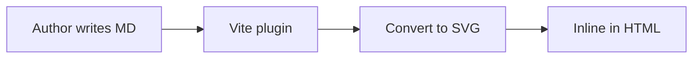
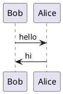
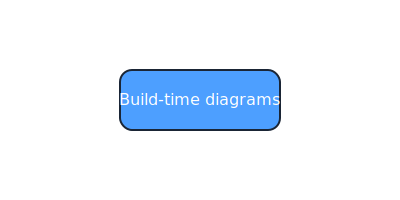

# Diagram Rendering Demo

Tests all four build-time diagram converters.

## Mermaid (inline fence)

```mermaid
graph LR
    A[Author writes MD] --> B[Vite plugin]
    B --> C[Convert to SVG]
    C --> D[Inline in HTML]
```

## PlantUML (inline fence)

```plantuml
@startuml
Bob -> Alice : hello
Alice -> Bob : hi
@enduml
```

## draw.io (referenced file)

## SVG (referenced file)

